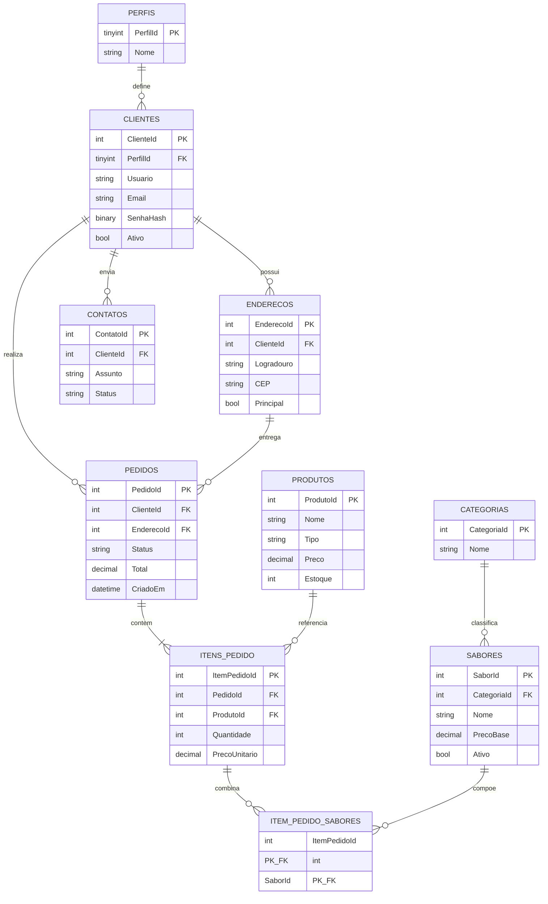

# Modelo Entidade-Relacionamento — Rocket Pizza

## Decisões principais

- Senhas são armazenadas como hash SHA-512 com salt individual; nunca em texto puro.
- Exclusões de clientes e sabores com histórico viram desativação lógica, preservando os pedidos.
- `ItensPedido` aceita produtos adicionais; sabores da pizza ficam em uma tabela associativa, permitindo meio a meio.
- O total do pedido é calculado pelo SQL Server para evitar divergências.
- Índices favorecem histórico por cliente e consulta do cardápio ativo.
